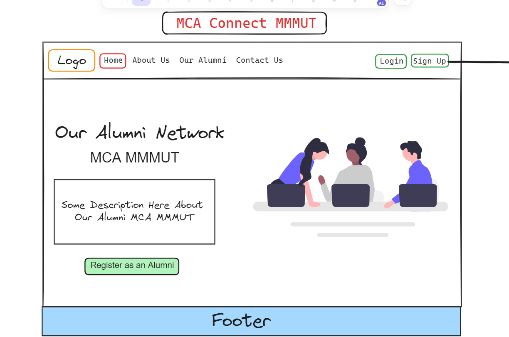
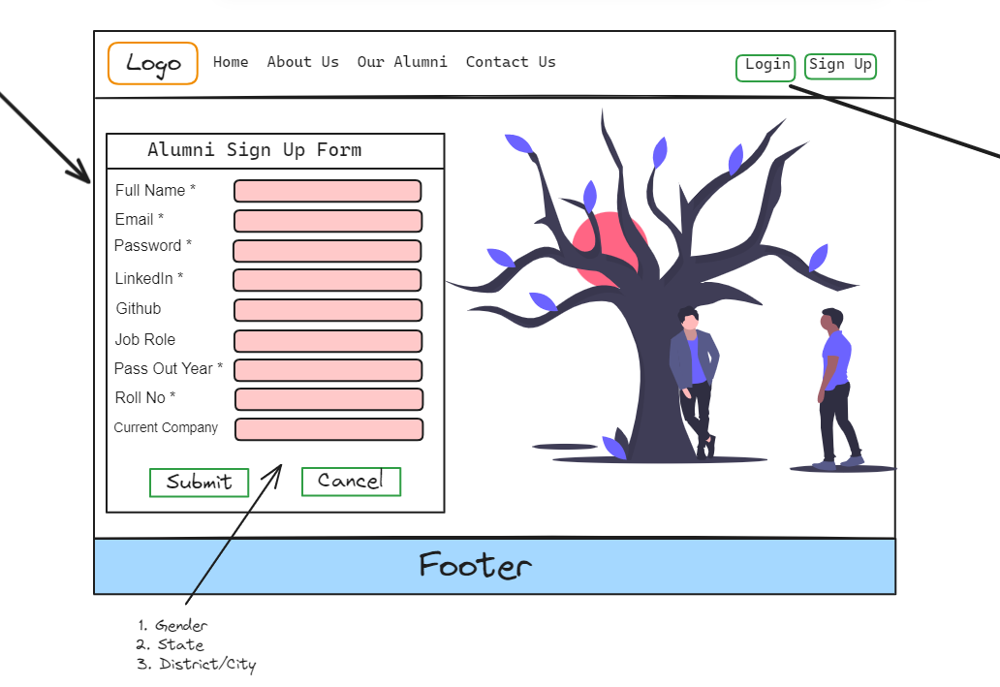
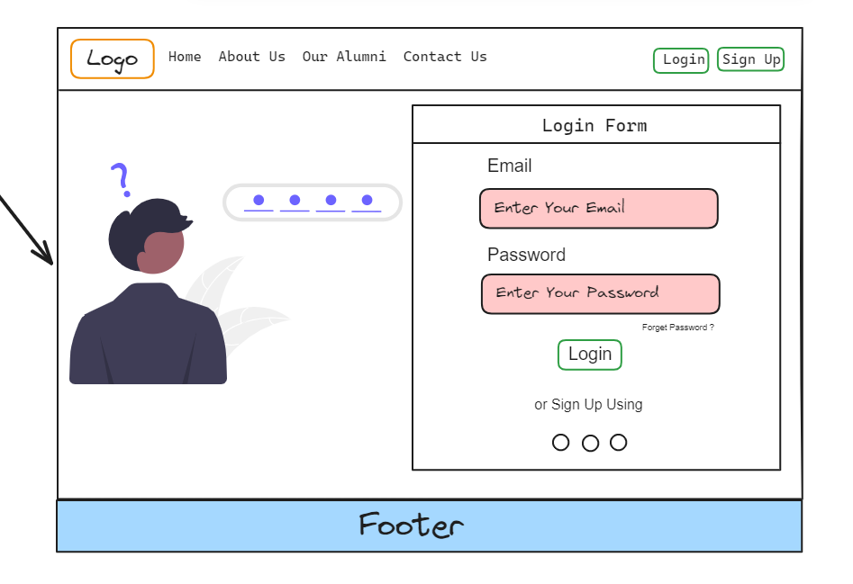
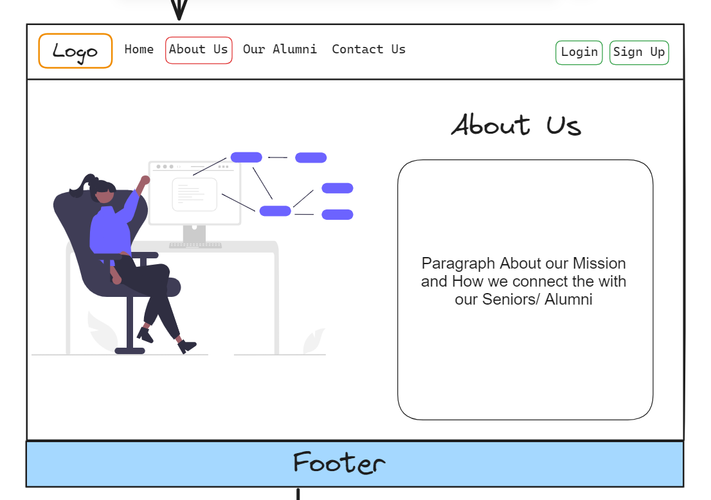
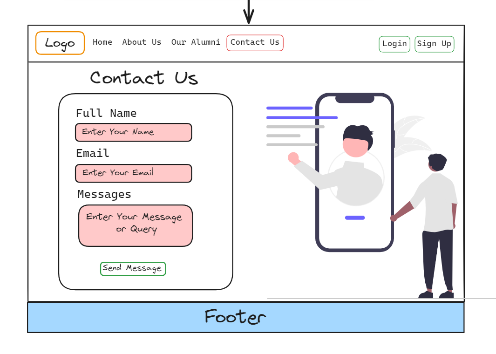
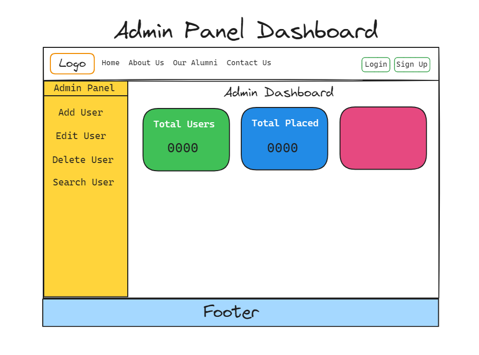
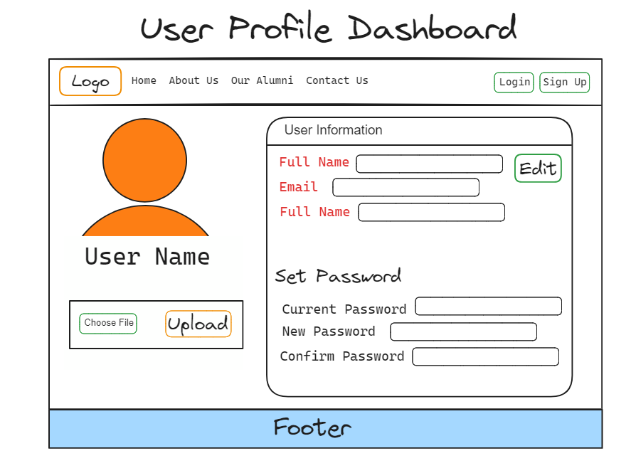

# MMMUT MCA Alumni Network

Welcome to the **MMMUT MCA Alumni Network**, an exclusive platform that connects the alumni of the MCA department at Madan Mohan Malaviya University of Technology (MMMUT). This web application allows current students, alumni, and faculty members to communicate, share career opportunities, and stay updated with the latest events and achievements of the alumni network.

## Features

- **Alumni Registration & Login**: Alumni can register themselves and log in to access the network.
- **Profile Management**: Alumni can create and update their profiles, including their current job role, skills, and achievements.
- **Job Board**: Alumni can share job opportunities, and students can apply directly through the platform.
- **Events & Announcements**: Stay informed about upcoming alumni events, webinars, and university announcements.
- **Networking**: Connect with fellow alumni and students through direct messaging.
- **Search Functionality**: Easily search for alumni based on location, industry, and skills.

## UI Ideas









## Technologies Used

- **Frontend**: 
  - React.js (JavaScript framework)
  - Tailwind CSS (for responsive and customizable UI)
  - Material-UI (for component styling)
  
- **Backend**:
  - Node.js (JavaScript runtime)
  - Express.js (Node.js framework)
  - MongoDB (Database)

- **Authentication**: 
  - JWT (JSON Web Token) for secure authentication.
  - OAuth2 for third-party login (Google, LinkedIn).

- **Deployment**: 
  - Vercel for frontend deployment.
  - Heroku for backend deployment.

## Getting Started

Follow these instructions to set up the project locally.

### Prerequisites

Before you begin, make sure you have the following installed:

- [Node.js](https://nodejs.org/en/download/) (v14 or higher)
- [MongoDB](https://www.mongodb.com/try/download/community) (local or cloud)
- A code editor like [VSCode](https://code.visualstudio.com/)

### Installation

1. **Clone the repository:**
   ```bash
   git clone https://github.com/abhishekraoas/MCA-Alumni-Network.git
   ```

2. **Navigate to the project directory:**
   ```bash
   cd MCA-Alumni-Network
   ```

3. **Install backend dependencies:**
   ```bash
   cd backend
   npm install
   ```

4. **Install frontend dependencies:**
   ```bash
   cd ../client
   npm install
   ```

### Running the Application

1. **Start MongoDB server:**
   - If you are using a local MongoDB instance, make sure your MongoDB server is running:
     ```bash
     mongod
     ```

2. **Configure environment variables:**
   - In the backend folder, create a `.env` file and add the following:
     ```
     PORT=3000
     URL_DB=<your_mongodb_connection_string>
     SECRET_KEY=<your_jwt_secret>
     ```

3. **Start the backend server:**
   ```bash
   cd backend
   npm run dev
   ```

4. **Start the frontend development server:**
   ```bash
   cd client
   npm run dev
   ```

   The frontend should now be running at `http://localhost:5173`, and the backend at `http://localhost:3000`.

### Directory Structure

The project is divided into two main directories: `frontend` and `backend`.

```
MCA-Alumni-Network/
│
├── backend/                 # Node.js server and API
│   ├── controllers/         # Request handling and business logic
│   ├── middlewares/         # Database and JWT configurations
│   ├── models/              # MongoDB schemas and models
│   ├── routes/              # API endpoints
│   └── server.js            # Main server file
│   ├── connectionDB.js      

│
├── frontend/                # React.js frontend
│   ├── src/
│   │   ├── components/      # Reusable UI components
│   │   ├── assets/           # images
│   │   ├── context/         # Context API for state management
│   │   └── App.js           # Main entry point for the frontend
│   └── public/
│       └── index.html       # HTML entry point for React
│
└── README.md                # Project information
```

## Contributing

We welcome contributions! If you would like to contribute to this project, please follow these steps:

1. Fork the repository.
2. Create a new branch for your feature or bugfix.
   ```bash
   git checkout -b feature/your-feature-name
   ```
3. Commit your changes.
   ```bash
   git commit -m "Add new feature: your-feature-name"
   ```
4. Push to your forked repository.
   ```bash
   git push origin feature/your-feature-name
   ```
5. Open a pull request to the main branch.

## License

This project is licensed under the MIT License - see the [LICENSE](LICENSE) file for details.

---

**Contact Information**

If you have any questions or need support, feel free to reach out to the project maintainers at **internetduniya02@gmail.com**.

--- 

This `README.md` file gives a clear overview of the project, its features, setup, and instructions on how to contribute or use the application. Let me know if you need any further details!